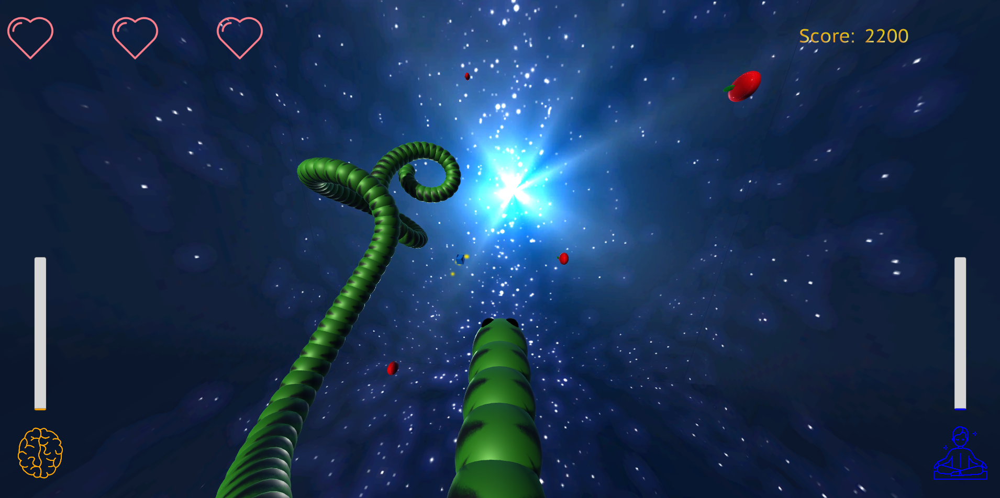
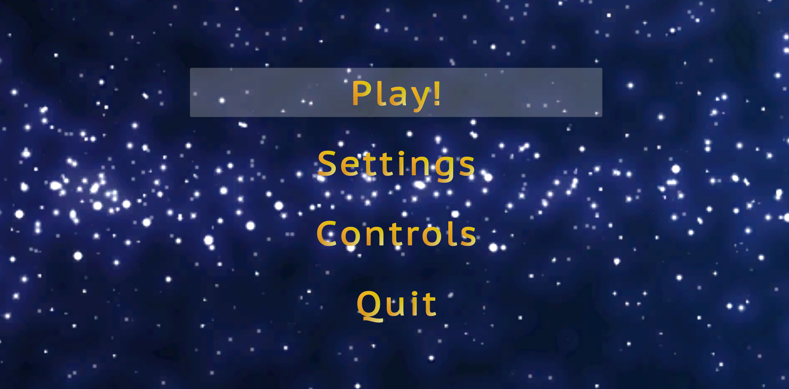

# NeuroSnake

3D snake game where you control snake with your mind and eyes. The goal is to eat as many apples as possible. However you can eat your tail as well and lose health, so be careful. You can restore health by eating a gold shining blue cube.

This game was made at college as a team project with cooperation with [drtinao](https://github.com/drtinao), who created GUI and menus for the game. My part in this project is the game algorithm, game design and controls. A part of the assignment was to create a Brain-Computer Interface (BCI) controls with [NeuroSky MindWave](https://store.neurosky.com/pages/mindwave) and [Tobii Eye Tracker](https://gaming.tobii.com/product/eye-tracker-5/).

MindWave was used to control snake's speed and Eye Tracker to manipulate snake's motion. For interface between Unity and MindWave I used a plugin made by [DaCookie](https://github.com/DaCookie/mindwave-unity). For Eye Tracker controls integration I used official [Tobii Eye Tracker SDK](https://developer.tobii.com/pc-gaming/unity-sdk/getting-started/) which is also included in this repository. (I encourage you to read [Tobii license](Assets/Tobii/License.pdf) before forking, distributing or otherwise using this code. I do not own any rights to Tobii SDK.)

## Installation

Copy directories `Assets`, `Packages` and `ProjectSettings` into your Unity project. Choose scene `MainMenu` and play it in Unity. The scene will change to `PlaySnake` scene after you click `Start`. Then you should be able to play. (Playing the scene `PlaySnake` immediately does not work for some reason.)

## BCI devices

In order to use the **NeuroSky MindWave** headset you must check the `Use MindWave` checkbox in `Settings` menu. If the MindWave is not connected to a pc, the game will still try to connect and you will not be able to play. If you wish to play without the headset, uncheck the checkbox in `Settings` and start the game.

While playing with MindWave, you will need to increase your focus -- your *beta brainwaves* activity, in order to make the snake move and go faster. The level of your focus is represented by an orange GUI sidebar. When you eat a blue cube, the game will switch to meditation state, during which you need to remain calm and relax -- make the *alpha brainwaves* more active and complete the meditation. If successful, the game will reward you with one restored health (if you lost any).

**Tobii Eye Tracker** starts working immediately when you plug it in. Feel free to unplug it during the game and continue playing. Screen is divided into four areas for Tobii Eye Tracking controls. According to where you look at your screen, there the snake will follow. Eg. when you are looking on top right side, the snake will turn up right, like if you were playing with a keyboard.

# Notice

The game is considered stable, however the Unity project not so much. This was my first Unity project, so some things might not be as good-practice-like as they should be. The project was developed with Unity version 2018.4.36f1. I tried to run the game with version 2021.2.1f1 and it run fine. Although the test with the new version was done without MindWave headset and Eye Tracker, because I do not have it in my possession anymore. I cannot promise that everything will work as expected in newer version of Unity. Opened issues and submitted pull requests are welcomed.

